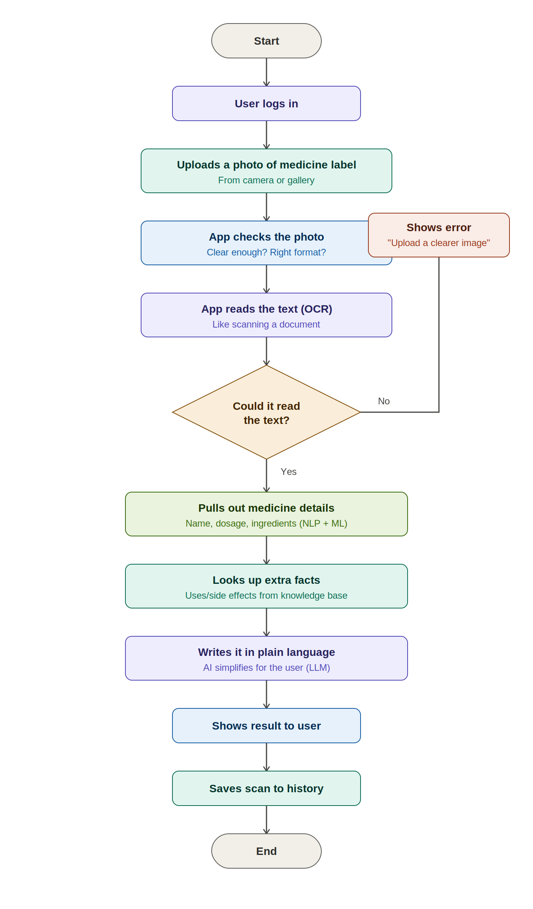
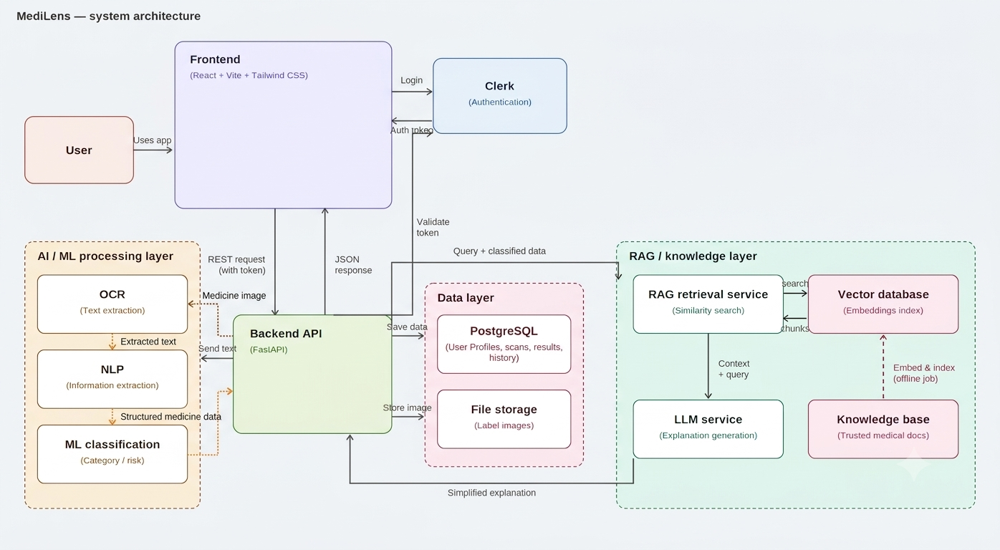
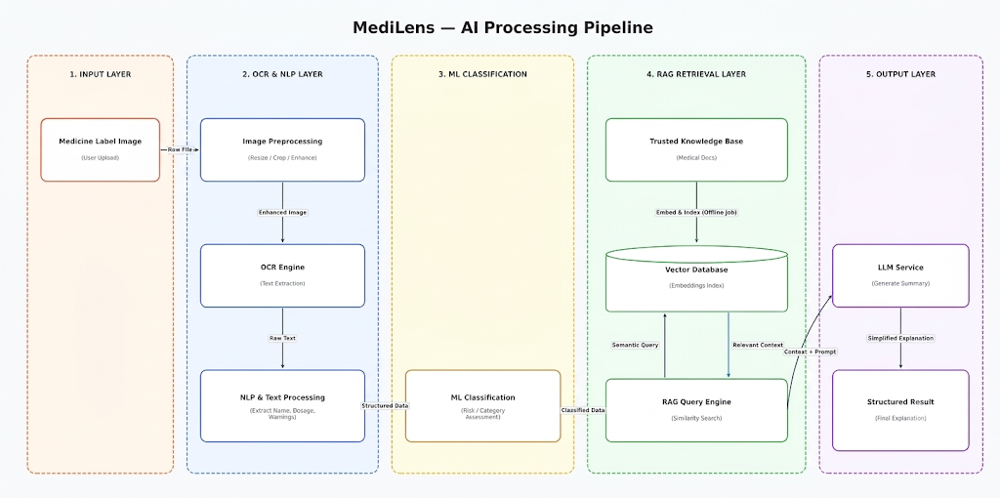

# MediLens — Medicine Label Simplifier

MediLens is an AI-powered application that helps users understand the information available on medicine labels.

Users can upload a medicine-label image, and the system extracts the important information and presents it in a simpler and more structured format.

The application combines OCR, NLP, Machine Learning, RAG, and LLM-based processing to extract, classify, retrieve, and explain medicine-related information.

> **Note:** MediLens is intended only for simplifying information available on medicine labels. It does not provide medical diagnosis, prescribe medicines, or recommend changes to dosage.

---

## Problem Statement

Medicine labels often contain technical terms, dosage information, warnings, instructions, and other details that can be difficult to understand.

This becomes more challenging when the label contains small text or unfamiliar medical terminology.

MediLens addresses this problem by allowing users to upload a medicine-label image and converting the information into a clear and easy-to-understand format.

---

## System Flowchart

The flowchart shows the complete process followed by MediLens, starting from user authentication and image upload, followed by image validation, OCR, NLP and ML processing, RAG-based retrieval, LLM explanation, and finally displaying and storing the result.



---

## System Architecture

MediLens follows a layered architecture consisting of the frontend, backend API, AI/ML processing, RAG and knowledge layer, authentication, and data storage.



---

## AI Processing Pipeline

The AI pipeline processes the uploaded medicine label in multiple stages:

**Medicine Image → Image Preprocessing → OCR → NLP → ML Classification → RAG Retrieval → LLM → Structured Result**



---

## Technologies Used

**Frontend**
- React
- Vite
- Tailwind CSS

**Backend**
- Python
- FastAPI

**Authentication**
- Clerk

**AI / ML**
- OCR for extracting text from medicine labels
- NLP for cleaning text and extracting medicine information
- Machine Learning for classification
- RAG for retrieving relevant information from the knowledge base
- Vector Database for semantic search
- LLM for generating simplified explanations

**Database & Storage**
- PostgreSQL
- File storage for uploaded medicine-label images

---

## Project Structure

```text
medicine-label-simplifier/
│
├── backend/
├── frontend/
├── ml/
│
├── docs/
│   ├── ai-pipeline/
│   │   └── medilens-ai-pipeline.png
│   │
│   ├── architecture/
│   │   └── medilens-architecture.png
│   │
│   ├── flowchart/
│   │   └── medilens-flowchart.png
│   │
│   ├── screenshots/
│   │
│   └── problem-statement.md
│
├── .gitignore
└── README.md
```